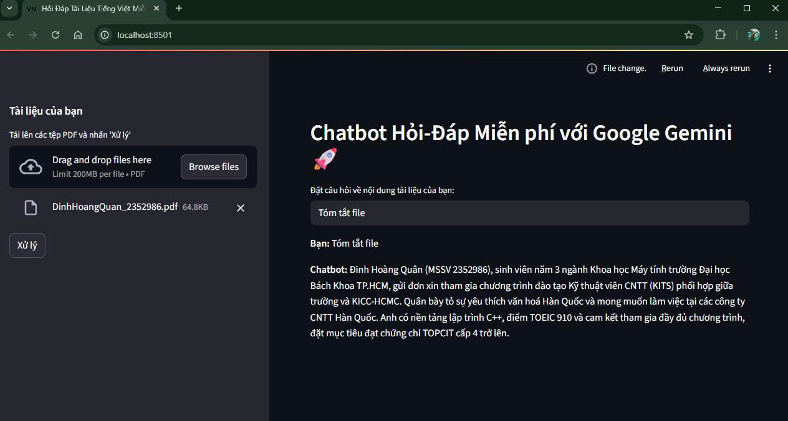

# 🇻🇳 Chatbot Hỏi-Đáp Tài liệu Tiếng Việt (Miễn phí)

Một chatbot AI tạo sinh (Generative AI) được xây dựng bằng kiến trúc RAG (Retrieval-Augmented Generation), cho phép người dùng "trò chuyện" và hỏi đáp về nội dung của bất kỳ tài liệu PDF tiếng Việt nào được tải lên. Dự án được xây dựng hoàn toàn bằng các công cụ và dịch vụ miễn phí.

---
## 🚀 Demo


*Giao diện ứng dụng khi đang trả lời câu hỏi của người dùng dựa trên một tài liệu PDF được tải lên.*



---
## ✨ Tính năng nổi bật

* **Tải lên tài liệu PDF:** Hỗ trợ tải lên một hoặc nhiều file PDF tiếng Việt.
* **Xử lý tự động:** Tự động phân tích, chia nhỏ và mã hóa nội dung văn bản.
* **Hỏi-đáp theo ngữ cảnh:** Sử dụng kiến trúc RAG để tìm kiếm thông tin liên quan trong tài liệu và tạo ra câu trả lời chính xác.
* **Giao diện trực quan:** Giao diện web đơn giản, dễ sử dụng được xây dựng bằng Streamlit.
* **Hoàn toàn miễn phí:** Tận dụng API miễn phí của Google Gemini và các model mã nguồn mở.

---
## 🔧 Công nghệ sử dụng

* **Ngôn ngữ:** Python
* **Giao diện web:** Streamlit
* **Framework AI:** LangChain
* **Model ngôn ngữ (LLM):** Google Gemini (`gemini-1.5-flash`)
* **Model Embedding:** `dangvantuan/vietnamese-embedding` (từ Hugging Face)
* **Cơ sở dữ liệu Vector:** FAISS (chạy trên CPU)

---
## ⚙️ Kiến trúc & Luồng hoạt động

Dự án tuân theo kiến trúc **Retrieval-Augmented Generation (RAG)**:

1.  **Nạp & Phân đoạn (Load & Chunk):** Tài liệu PDF được đọc và chia thành các đoạn văn bản nhỏ (chunks).
2.  **Mã hóa (Embed):** Mỗi chunk được chuyển đổi thành một vector số học bằng model embedding tiếng Việt.
3.  **Lưu trữ (Store):** Các vector này được lưu vào cơ sở dữ liệu vector FAISS.
4.  **Truy xuất (Retrieve):** Khi người dùng đặt câu hỏi, câu hỏi cũng được mã hóa thành vector và FAISS sẽ tìm ra các chunk văn bản có nội dung liên quan nhất.
5.  **Tạo sinh (Generate):** Các chunk liên quan cùng với câu hỏi của người dùng được gửi đến model Gemini để tạo ra câu trả lời cuối cùng.

```mermaid
flowchart LR
    A[Tải lên file PDF] --> B[1. Phân đoạn văn bản];
    B --> C[2. Mã hóa thành Vector <br> (Hugging Face)];
    C --> D[3. Lưu vào FAISS Vector Store];
    E[Người dùng đặt câu hỏi] --> F[4. Mã hóa câu hỏi];
    F --> G{5. Truy xuất các đoạn <br> văn bản liên quan};
    D --> G;
    G --> H[6. Tạo câu trả lời <br> (Google Gemini)];
    H --> I[Hiển thị cho người dùng];
```

---
## ▶️ Cài đặt và Chạy dự án

#### 1. Clone repository
```bash
git clone [https://github.com/hqunn/Vietnamese-document-Chatbot-with-RAG.git](https://github.com/hqunn/Vietnamese-document-Chatbot-with-RAG.git)
cd vietnamese-rag-chatbot
```
#### 2. Tạo và kích hoạt môi trường ảo
*Khuyến nghị sử dụng Python 3.11*
```bash
# Tạo môi trường ảo
python -m venv .venv

# Kích hoạt trên Windows
.\.venv\Scripts\activate

# Kích hoạt trên macOS/Linux
source .venv/bin/activate
```

#### 3. Cài đặt các thư viện cần thiết
```bash
pip install -r requirements.txt
```

#### 4. Thiết lập API Key
* Tạo một file tên là `.env` trong thư mục gốc của dự án.
* Thêm Google AI API Key của bạn vào file này:
    ```
    GOOGLE_API_KEY="AIzaSy...xxxxxxxx"
    ```

#### 5. Chạy ứng dụng
```bash
streamlit run app.py
```

Sau khi chạy lệnh trên, một tab mới trên trình duyệt sẽ tự động mở ra. Bây giờ bạn có thể bắt đầu sử dụng ứng dụng!